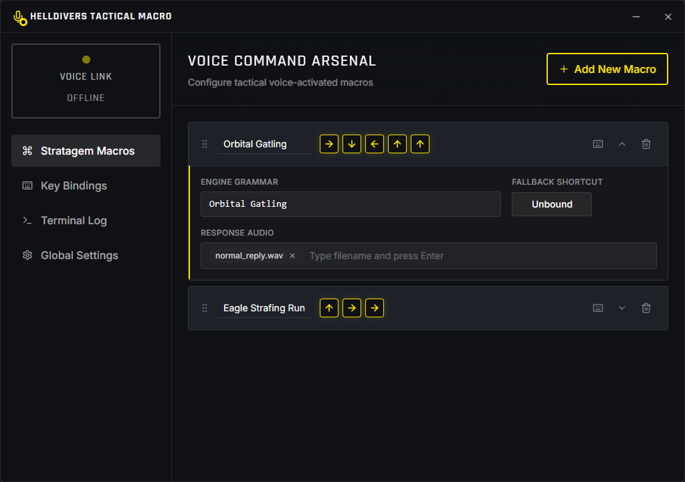

# Hellcall Desktop

English | [中文](docs/README_zh.md)

Hellcall Desktop is a cross-platform desktop application built with Tauri, React, and Rust. It provides a seamless way to configure and manage voice-activated keyboard macros—designed to enhance gameplay experiences (such as calling stratagems in Helldivers 2).



## Features

- **Voice-Activated Macros:** Trigger custom key sequences using your microphone.
- **Configurable Recognizer:** Adjust VAD (Voice Activity Detection) silence duration and chunk times for optimal responsiveness.
- **Advanced Key Presser:** Fine-tune key release intervals, inter-key intervals, and initial wait times.
- **Customizable Triggers & Macros:** Define specific hit-words, grammars, and shortcuts to trigger sequences. You can also assign custom audio feedback (e.g., `normal_reply.wav`).
- **Vision-Based OCC:** Utilize an experimental "One-Click Completion" (OCC) vision module to automatically recognize game states via YOLO computer vision and trigger stratagems instantly.
- **Modern UI:** Built with React 19, Tailwind CSS 4, and Radix UI primitives. It features a sleek, game-inspired dark theme and a drag-and-drop interface for sorting your macros.
- **Localization:** Multi-language support (English and Chinese) powered by `react-i18next`.

## Tech Stack

- **Frontend:** React 19, Vite, TypeScript, Tailwind CSS 4, Zustand (State Management), @dnd-kit (Drag and Drop), Radix UI.
- **Backend/Desktop Framework:** Tauri 2.0, Rust.
- **Voice Engine:** Integrated [Vosk](https://alphacephei.com/vosk/) speech recognition engine.
- **Computer Vision:** High-performance YOLO inference powered by [ONNX Runtime (ort)](https://github.com/ort-rs/ort) with CUDA hardware acceleration support.

## Prerequisites

- Node.js (v18+)
- Rust (Latest stable toolchain)
- Bun (or your preferred Node package manager)

## Model Setup

Hellcall now downloads speech and vision model assets at runtime into the application's writable data directory. You no longer need to manually unpack model files into the repo before using the app.

1. **Native Vosk Library (`src-tauri/lib`)**:
   Download the precompiled `libvosk` library for your operating system (Windows/macOS/Linux) from the [Vosk Releases page](https://github.com/alphacep/vosk-api/releases). Extract the files and place the dynamic library (for example `.dll`, `.dylib`, or `.so`) inside `src-tauri/lib/`.

2. **Vosk Speech Models**:
   Open **Global Settings** in the app, choose a Vosk model, and click **Download Model**.
   - Use a **small** Vosk model such as `vosk-model-small-en-us-0.15` or `vosk-model-small-cn-0.22`.
   - Downloaded Vosk assets are stored under the app's local data directory at `models/vosk/<model-id>/`.

3. **Vision / OCC Model (Optional)**:
   The YOLO `.onnx` model used by OCC can also be downloaded from **Global Settings**.
   - The file is stored under the app's local data directory at `models/vision/`.

## Getting Started

1. **Clone the repository:**
   ```bash
   git clone https://github.com/LyceumHewun/hellcall-desktop.git
   cd hellcall-desktop
   ```

2. **Install frontend dependencies:**
   
   ```bash
   bun install
   ```
   *(Alternatively, use `npm install`, `yarn`, or `pnpm install`)*
   
3. **Run in development mode:**
   ```bash
   bun tauri dev
   ```
   This command starts the Vite development server and launches the Tauri window. After the app opens, download the Vosk model you want from **Global Settings** before enabling Voice Link.

4. **Build for production:**
   ```bash
   bun tauri build
   ```
   The final executable bundle will be compiled into `src-tauri/target/release/`.

## Directory Structure

- `/src` - React frontend code (UI components, Views, Zustand store, Types).
- `/src-tauri` - Rust backend, Tauri configuration, native plugins, and bundled runtime dependencies (such as audio assets and the native Vosk library).
- `/src/store` - Zustand store (`configStore.ts`) for managing global state and interacting with the Rust backend.
- `/src/app/views` - Core views including Macros, Global Settings, Key Bindings, and Logs.

## Configuration

Settings are managed seamlessly and saved locally via Tauri's application data directory. A `config.toml` file is automatically generated to store:
- Voice Recognition tuning
- Key simulation timings
- Trigger word logic
- Complete list of saved command macros

Downloaded model assets are also stored in the app's local data directory rather than in the installation folder, so they remain writable after packaging.

## License

This project is licensed under the MIT License.
